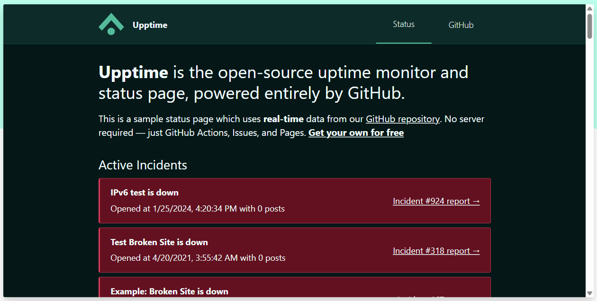
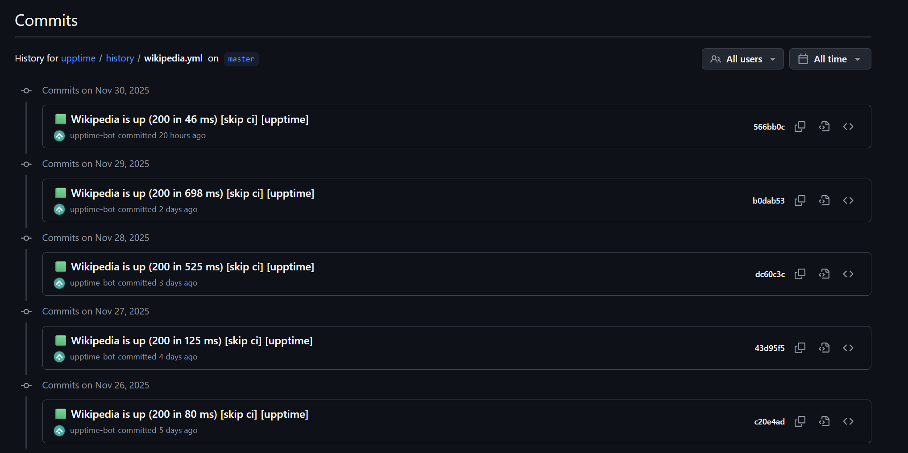
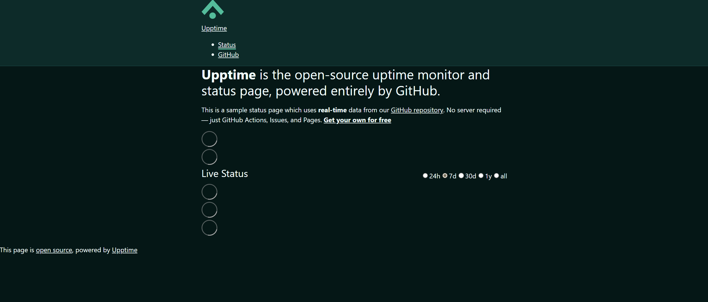
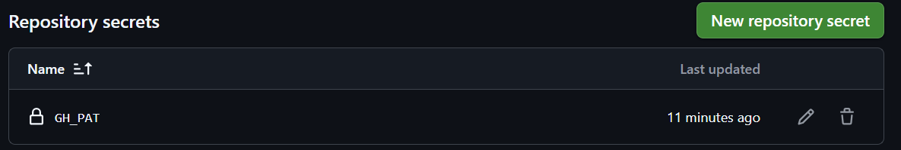
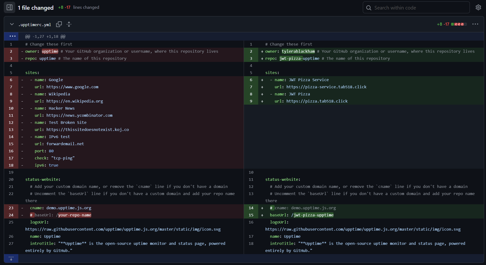
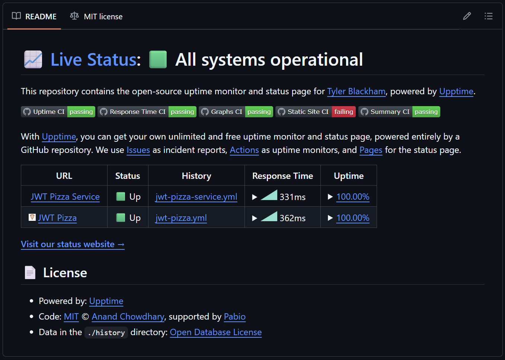
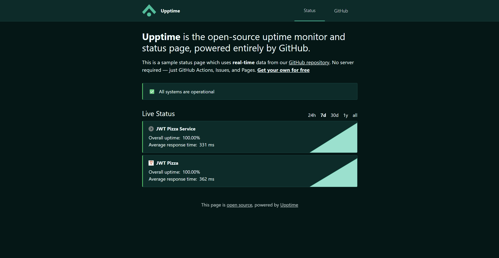

# Curiosity Report - [UppTime](https://upptime.js.org/)

## Introduction
For my curiosity report, I wanted to look into UppTime, a completely free monitoring and status page service. UppTime
was referenced in our reading [here](https://github.com/devops329/devops/blob/6d03739d2ea63ed603ec7315dd8c694a172bf3aa/instruction/statusReporting/statusReporting.md#upptime) and I thought it would be interesting to explore the service as an alternative
to some of the options we discussed in class.

## Initial Discovery

I wanted to see what UppTime could actually do and how it was being used. Additionally, I wanted to see what UppTime
and others were saying about UppTime's service.

### UppTime Documentation

First, I explored UppTime's main website to see an overview of it works. The main page has an example of what a 
status page would like. The pages that they build are powered by Svelte and seem pretty clean and simple.

The example page can also be accessed [here](https://demo.upptime.js.org/). Below the example page, they have some more 
information. Their monitoring is powered by GitHub Actions and allows the monitoring of unlimited webpages. I was 
immediately intrigued by how they could do all of that with only GitHub Actions.

Going to their [documentation page](https://upptime.js.org/docs/) provided some more information. Everything is powered 
by GitHub: GitHub Actions for uptime monitoring, GitHub Issues for incident reports, and GitHub Pages for the status 
website. Apparently you can set GHA workflow to run every 5 minutes, so UppTime has their workflow visit your website every 5
minutes and keeps track of response time for future reporting. If a specified endpoint goes down, they can immediately 
create an issue in your GitHub repository. The issue will be closed when the endpoint is back up. All the information
that is collected in the workflow is then displayed on the status page.

Here is an example of the commit history that keeps track of the daily response time reports. It can also be found [here](https://github.com/upptime/upptime/commits/master/history/wikipedia.yml)

### Other Opinions

To make my research a little easier, I simplified my searching by using ChatGPT for a summary of reviews and
how UppTime has been received.

#### Key Points

- "UppTime is a lightweight, cost-effective, open-source way to monitor a website or service’s uptime and publish a 
publicly visible status page — perfect for small projects, open-source services, or people who want monitoring without 
paying a SaaS vendor."
- The benefits of UppTime are 
  - zero infrastructure / minimal setup
  - no cost
  - transparency and versioning
  - simplicity and flexibility
- Limitations
  - Dependence on GitHub
  - Not a full-feature Enterprise solution
- Not ideal when
  - You manage a large-scale production service that requires high reliability, SLA commitments, complex alerting, or 
enterprise-level support.

## Setting It Up

Now that I had a good understanding of what UppTime was and what it offered, I wanted to try and set it up. I followed
the [getting started](https://upptime.js.org/docs/get-started) instructions to set up my new repository. After using their template to generate my new 
repository, [jwt-pizza-upptime](https://github.com/tylerablackham/jwt-pizza-upptime) and following a few simple instructions, I already had a live status page, although 
there was no information populated yet.

Next I followed a few simple steps to create a GitHub Access Token and created a repository secret with it. This allows 
the actions to have access to my jwt-pizza-upptime repository. 

Lastly, I had to clone the repo and make some changes to the [.upptimerc.yml file](https://github.com/tylerablackham/jwt-pizza-upptime/blob/master/.upptimerc.yml) so that it would know to query
the specific endpoints that I wanted. I had it target by jwt-pizza-service endpoint and my jwt-pizza home page.

Once I pushed the changes back up it automatically updated the upptime page and even the readme in my repository.

 

## Conclusion

The setup to make this page was very minimal. The most complex part was setting up the GitHub acces token (even that was 
simple, though). For how simple it is, it looks very clean and seems to be very configurable. There was a ton of different
documentation on their page for all the different configuration options available. 

If you want to visit my upptime page, click [here](https://tylerablackham.github.io/jwt-pizza-upptime/)
