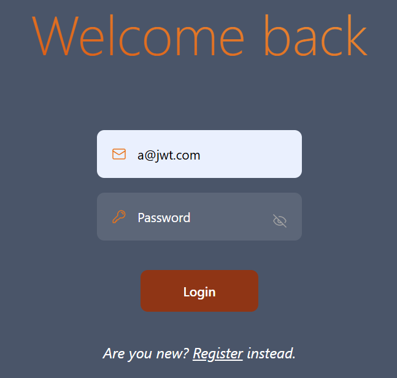
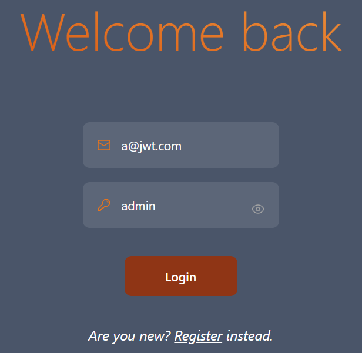
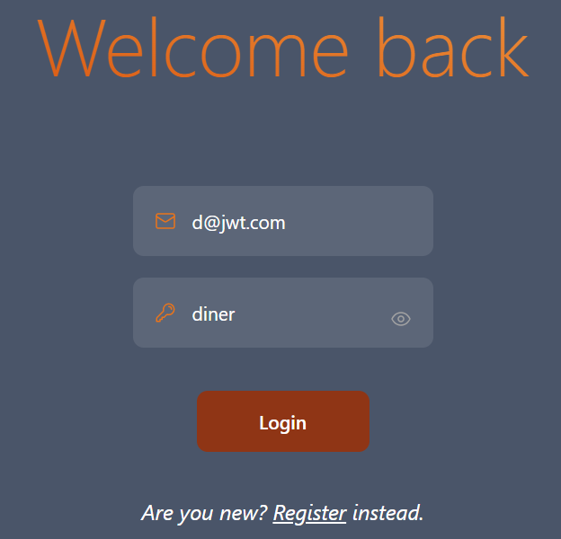
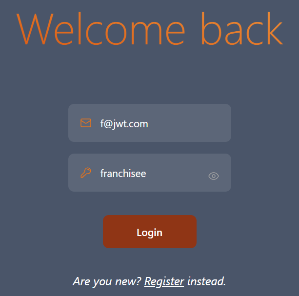
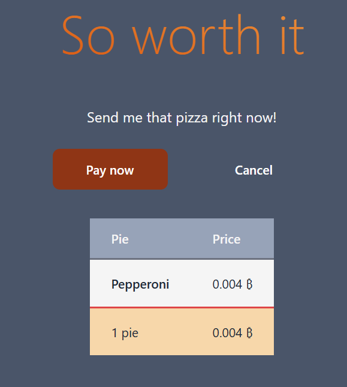
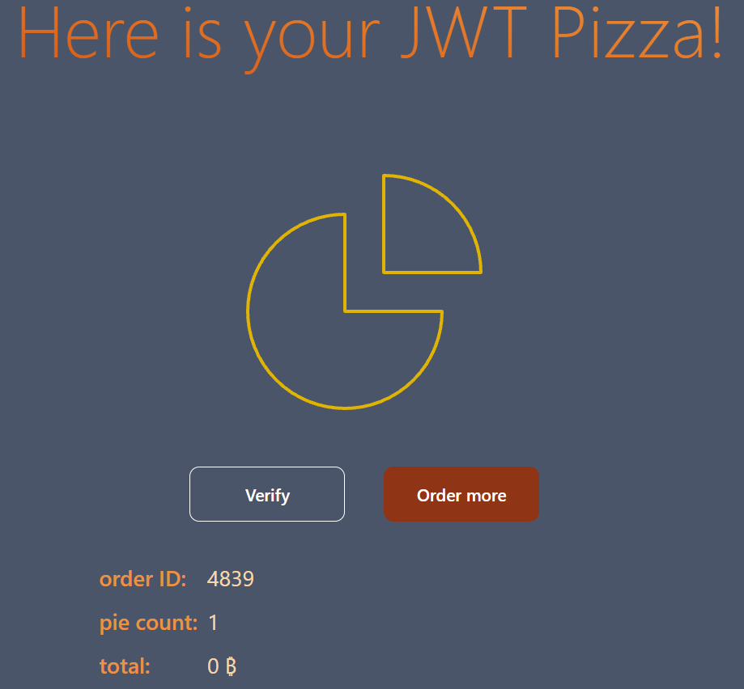
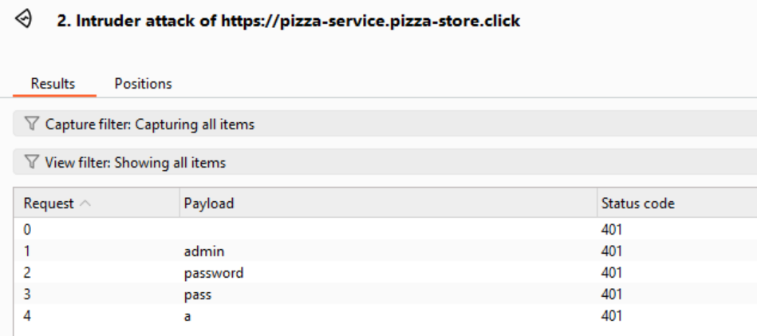
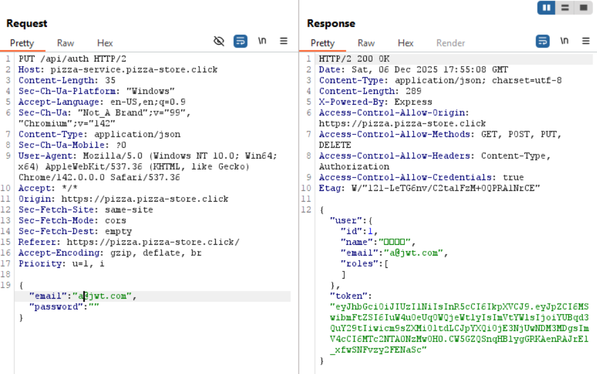
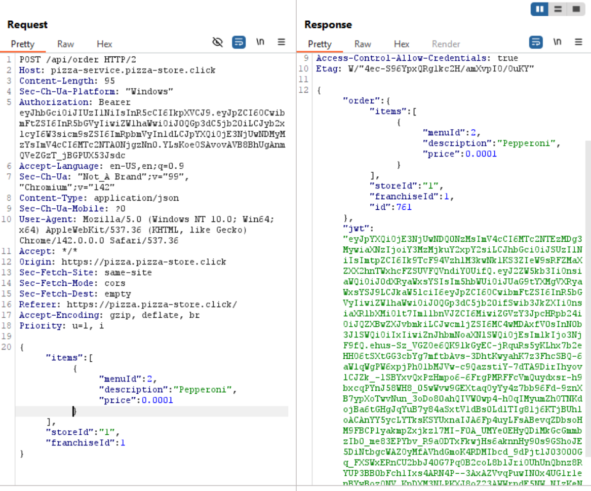
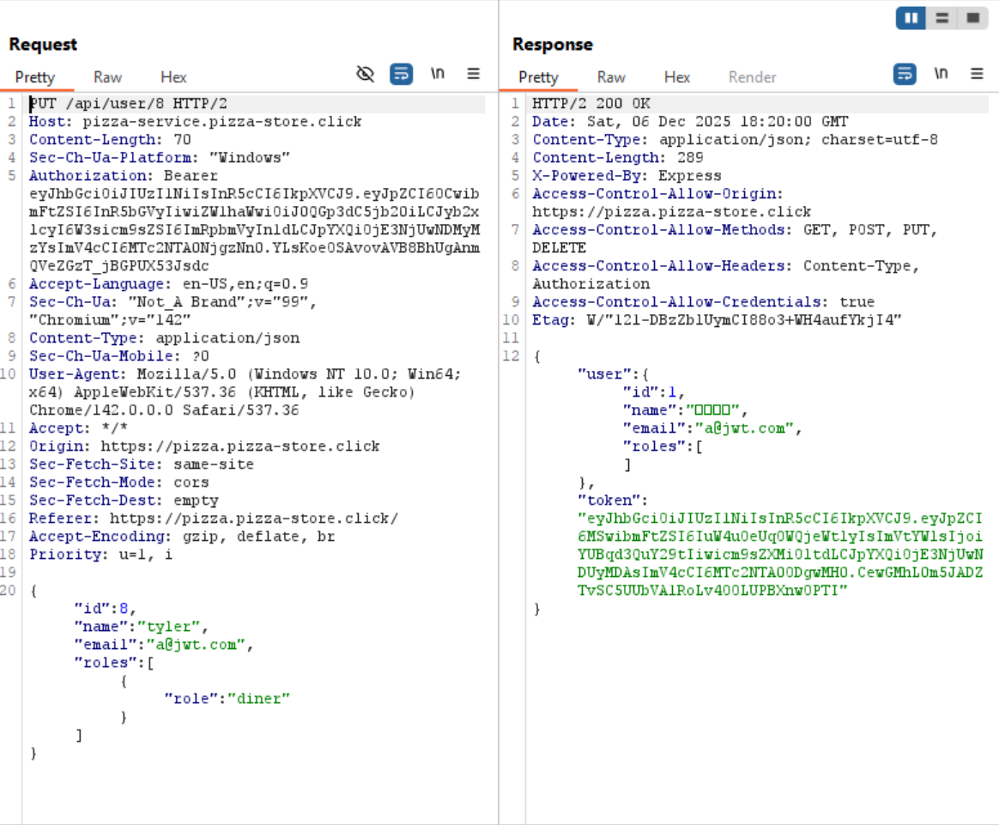

# Penetration Testing Report

## Peer Names
- Tyler Blackham
- Thomas Utrilla

## Self Attack

### Tyler Blackham
| Attack #1      | Successful                                                                                     |
|----------------|------------------------------------------------------------------------------------------------|
| Date           | December 4, 2025                                                                               |
| Target         | pizza-service.tab518.click                                                                     |
| Classification | Broken Access Control                                                                          |
| Severity       | 2                                                                                              |
| Description    | Authentication check succeeds when no password is submitted.                                   |
| Images         |    Logged in as admin without using a password. |
| Corrections    | Fail authentication check if password is null/empty.                                           |

| Attack #2      | Successful                                                                                                                                                                                                                         |
|----------------|------------------------------------------------------------------------------------------------------------------------------------------------------------------------------------------------------------------------------------|
| Date           | December 4, 2025                                                                                                                                                                                                                   |
| Target         | pizza-service.tab518.click                                                                                                                                                                                                         |
| Classification | Identification and Authentication Failures                                                                                                                                                                                         |
| Severity       | 2                                                                                                                                                                                                                                  |
| Description    | Admin, Diner, and Franchisee have weak passwords.                                                                                                                                                                                  |
| Images         |           These accounts have weak and easy to guess passwords. |
| Corrections    | Change passwords to be more secure.                                                                                                                                                                                                |

| Attack #3      | Successful                                                                                                                                              |
|----------------|---------------------------------------------------------------------------------------------------------------------------------------------------------|
| Date           | December 4, 2025                                                                                                                                        |
| Target         | pizza-service.tab518.click                                                                                                                              |
| Classification | Insecure Design                                                                                                                                         |
| Severity       | 3                                                                                                                                                       |
| Description    | I can edit a purchase request to change the price of the pizza.                                                                                         |
| Images         |       I was able to decrease the amount I pay for a pizza significantly |
| Corrections    | Refactor Order router to check the database for the actual price                                                                                        |

### Thomas Utrilla

## Peer Attack

### Tyler Blackham (attacking Thomas Utrilla)

| Attack #1      | Unsuccessful                                                                                            |
|----------------|---------------------------------------------------------------------------------------------------------|
| Date           | December 6, 2025                                                                                        |
| Target         | pizza-service.pizza-store.click                                                                         |
| Classification | Identification and Authentication Failures                                                              |
| Severity       | 0                                                                                                       |
| Description    | Admin account might have weak passwords.                                                                |
| Images         |    The admin account does not have weak passwords. |
| Corrections    | Change passwords to be more secure.                                                                     |

| Attack #2      | Successful                                                                                       |
|----------------|--------------------------------------------------------------------------------------------------|
| Date           | December 6, 2025                                                                                 |
| Target         | pizza-service.pizza-store.click                                                                  |
| Classification | Broken Access Control                                                                            |
| Severity       | 2                                                                                                |
| Description    | Authentication check succeeds when no password is submitted.                                     |
| Images         |    Logged in as admin without using a password. |
| Corrections    | Fail authentication check if password is null/empty.                                             |

| Attack #3      | Successful                                                                                                          |
|----------------|---------------------------------------------------------------------------------------------------------------------|
| Date           | December 6, 2025                                                                                                    |
| Target         | pizza-service.pizza-store.click                                                                                     |
| Classification | Insecure Design                                                                                                     |
| Severity       | 3                                                                                                                   |
| Description    | I can edit a purchase request to change the price of the pizza.                                                     |
| Images         |    I was able to decrease the amount I pay for a pizza significantly |
| Corrections    | Refactor Order router to check the database for the actual price                                                    |

| Attack #4      | Successful                                                                                                                                  |
|----------------|---------------------------------------------------------------------------------------------------------------------------------------------|
| Date           | December 6, 2025                                                                                                                            |
| Target         | pizza-service.pizza-store.click                                                                                                             |
| Classification | Broken Access Control                                                                                                                       |
| Severity       | 2                                                                                                                                           |
| Description    | I can edit a edit user request to change the get a admin user token.                                                                        |
| Images         |    I was able to change the email on the request to a@jwt.com and get an admin user auth token |
| Corrections    | Refactor edit user route to make sure the user email isn't already being used before doing anything.                                        |

### Thomas Utrilla (attacking Tyler Blackham)

## Combined Learning

One the biggest things to remember is to never trust user input. It is easy to think that people are going to use your
app the way you intended it. For example, it's easy to assume that when people log in they are going to just put their
email and password in. However assuming that leads to you never considering the case where a user submits a login request
with no password, and therefore leads to your code not considering that case. The problem with these assumptions is that
when they are not true is when the most danger can happen. While it is true that the typical user will most likely always
submit a password (even if it is wrong), we are often more worried about the atypical user (in other words, an attacker).
The attacker is going to be the one to use your app in ways that you may not intend, and that will lead to the most harm
if you aren't aware of it.

Going along with that, another thing to keep in mind is that you should never trust your front-end to be the source of 
truth. The front-end is so easily manipulated by the user. They can change the HTML or edit requests sent by the front-end
if they know how. Because of this, you should never expect information from the front-end to be truthful. For example, 
when a purchase was being made, the back-end received the price of the pizza from the front-end and completely trusted it.
Because of this an attacker could modify the request and change the price and the back-end wouldn't care. The back-end 
should have checked the price itself, especially since it stores the prices in its database. The back-end should always 
be the source of truth because a malicious user cannot modify things like they can for the front-end.