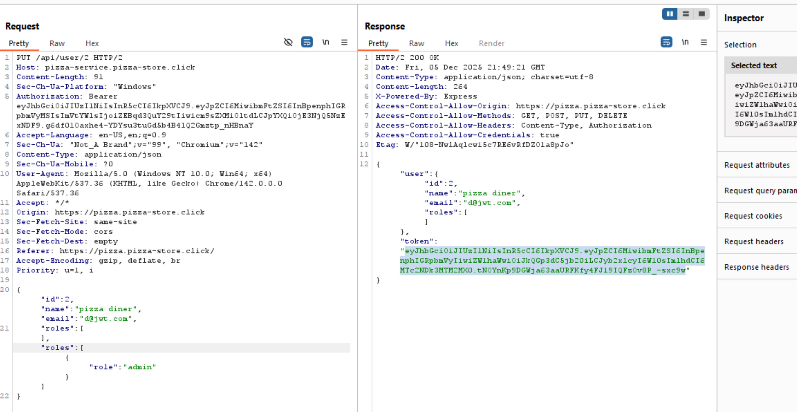
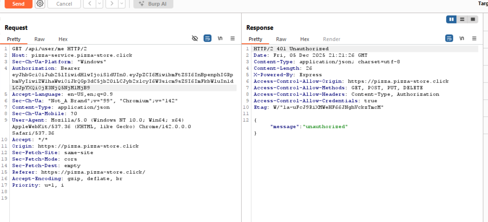
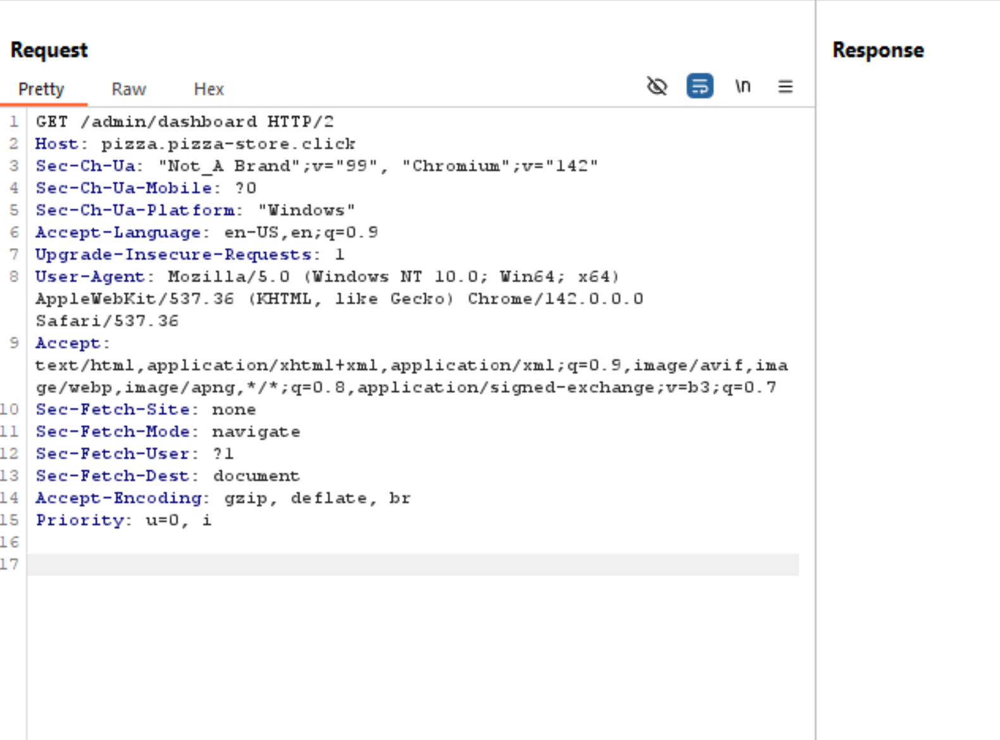
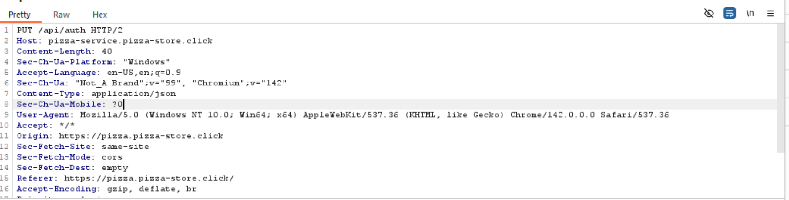
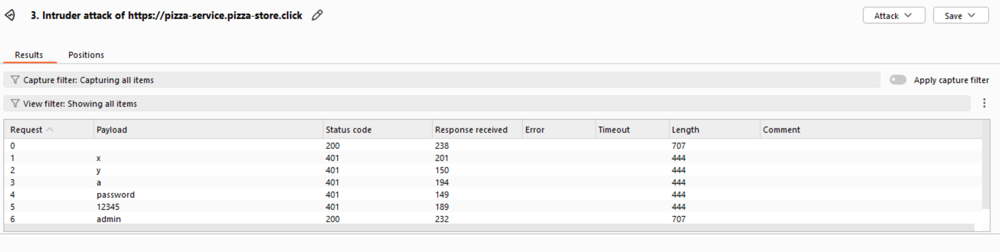
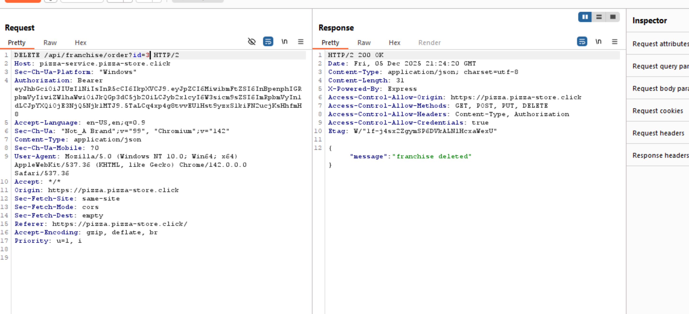
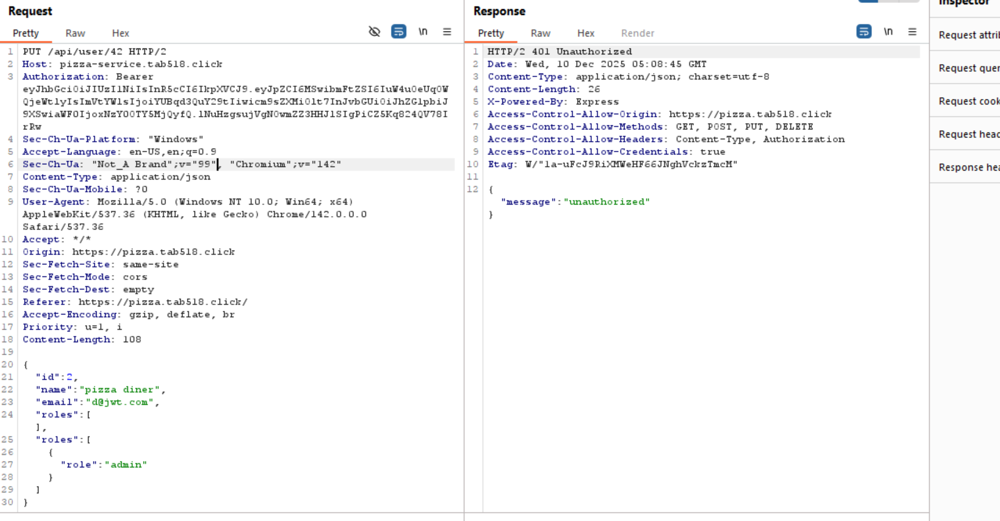
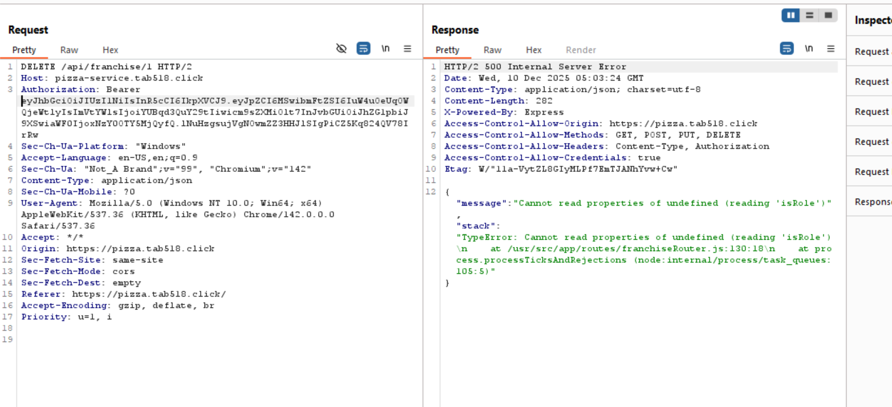
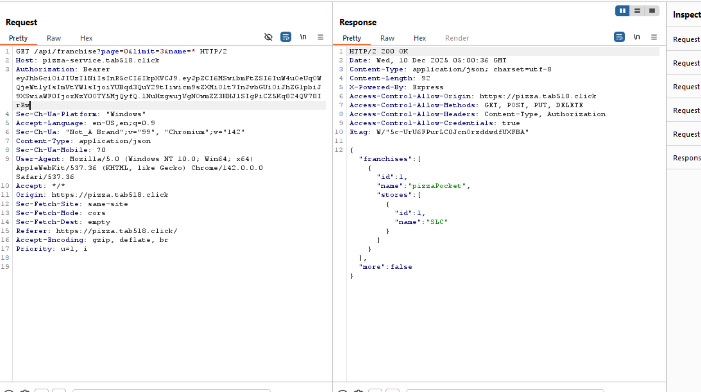
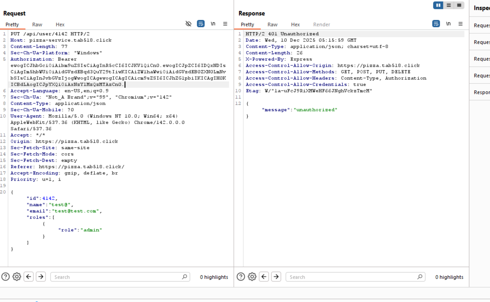

# Penetration Testing Report

## Peer Names
- Tyler Blackham
- Thomas Utrilla

## Self Attack

### Tyler Blackham
| Attack #1      | Successful                                                                                     |
|----------------|------------------------------------------------------------------------------------------------|
| Date           | December 4, 2025                                                                               |
| Target         | pizza-service.tab518.click                                                                     |
| Classification | Broken Access Control                                                                          |
| Severity       | 2                                                                                              |
| Description    | Authentication check succeeds when no password is submitted.                                   |
| Images         |    Logged in as admin without using a password. |
| Corrections    | Fail authentication check if password is null/empty.                                           |

| Attack #2      | Successful                                                                                                                                                                                                                         |
|----------------|------------------------------------------------------------------------------------------------------------------------------------------------------------------------------------------------------------------------------------|
| Date           | December 4, 2025                                                                                                                                                                                                                   |
| Target         | pizza-service.tab518.click                                                                                                                                                                                                         |
| Classification | Identification and Authentication Failures                                                                                                                                                                                         |
| Severity       | 2                                                                                                                                                                                                                                  |
| Description    | Admin, Diner, and Franchisee have weak passwords.                                                                                                                                                                                  |
| Images         |           These accounts have weak and easy to guess passwords. |
| Corrections    | Change passwords to be more secure.                                                                                                                                                                                                |

| Attack #3      | Successful                                                                                                                                              |
|----------------|---------------------------------------------------------------------------------------------------------------------------------------------------------|
| Date           | December 4, 2025                                                                                                                                        |
| Target         | pizza-service.tab518.click                                                                                                                              |
| Classification | Insecure Design                                                                                                                                         |
| Severity       | 3                                                                                                                                                       |
| Description    | I can edit a purchase request to change the price of the pizza.                                                                                         |
| Images         |       I was able to decrease the amount I pay for a pizza significantly |
| Corrections    | Refactor Order router to check the database for the actual price                                                                                        |

### Thomas Utrilla
## 1. Attempted Broken Access Control — Unauthorized User Update  

| Item           | Result                                                                                                                                 |
| -------------- | -------------------------------------------------------------------------------------------------------------------------------------- |
| Date           | December 5th, 2025                                                                                                                    |
| Target         | https://pizza.pizza-store.click/                                                                                                      |
| Classification | Broken Access Control (OWASP A01:2021)                                                                                                |
| Severity       | 0 — Unsuccessful                                                                                                                      |
| Description    | Attempted to modify another user’s account and assign admin roles. The server rejected the request with `401 Unauthorized`, preventing privilege escalation. |
| Images         |                                                            |
| Corrections    | No correction needed                                                                       |

---

## 2. Attempted Authentication Bypass / Unauthorized Access to User Data  

| Item           | Result                                                                                                                                 |
| -------------- | -------------------------------------------------------------------------------------------------------------------------------------- |
| Date           | December 5th, 2025                                                                                                                    |
| Target         | https://pizza.pizza-store.click/                                                                                                      |
| Classification | Identification & Authentication Failures (OWASP A07:2021)                                                                             |
| Severity       | 0 — Unsuccessful                                                                                                                      |
| Description    | Attempted to retrieve authenticated user data via `/api/user/me` without valid credentials. Server responded with `401 Unauthorized`, blocking the request. |
| Images         |                                                                              |
| Corrections    | No correction needed                                                                         |

---

## 3. Attempted Admin Dashboard Access  

| Item           | Result                                                                                                                                 |
| -------------- | -------------------------------------------------------------------------------------------------------------------------------------- |
| Date           | December 5th, 2025                                                                                                                    |
| Target         | https://pizza.pizza-store.click/                                                                                                      |
| Classification | Broken Access Control (OWASP A01:2021)                                                                                                |
| Severity       | 0 — Unsuccessful                                                                                                                      |
| Description    | Attempted to load `/admin/dashboard` directly without authentication. The server did not return protected admin content, preventing unauthorized admin panel access. |
| Images         |                                          |
| Corrections    | No correction needed                                                                         |

---

## 4. Attempted Credential Attack / Weak Password Attempt  

| Item           | Result                                                                                                                                 |
| -------------- | -------------------------------------------------------------------------------------------------------------------------------------- |
| Date           | December 5th, 2025                                                                                                                    |
| Target         | https://pizza.pizza-store.click/                                                                                                      |
| Classification | Cryptographic Failures (OWASP A02:2021) / Authentication Failures (A07:2021)                                                          |
| Severity       | 0 — Unsuccessful                                                                                                                      |
| Description    | Attempted to authenticate using invalid or weak credentials via `/api/auth`. The server rejected the login with `401 Unauthorized`, confirming proper password verification. |
| Images         |                                          |
| Corrections    | No correction needed                                                         |

---

## 5. Attempted Brute Force Attack via Intruder  

| Item           | Result                                                                                                                                 |
| -------------- | -------------------------------------------------------------------------------------------------------------------------------------- |
| Date           | December 5th, 2025                                                                                                                    |
| Target         | https://pizza.pizza-store.click/                                                                                                      |
| Classification | Identification & Authentication Failures (OWASP A07:2021)                                                                             |
| Severity       | 0 — Unsuccessful                                                                                                                      |
| Description    | Conducted a brute-force login attempt using common passwords (`x`, `y`, `a`, `password`, `12345`). All attempts failed except the baseline valid request. No unauthorized login occurred. |
| Images         |                                                                        |
| Corrections    | Consider implementing rate limiting or lockout policies to further mitigate brute-force attempts.                                      |

---

## 6. Successful Broken Access Control — Unauthorized Franchise Deletion  

| Item           | Result                                                                                                                                 |
| -------------- | -------------------------------------------------------------------------------------------------------------------------------------- |
| Date           | December 5th, 2025                                                                                                                    |
| Target         | https://pizza.pizza-store.click/                                                                                                      |
| Classification | Broken Access Control (OWASP A01:2021)                                                                                                |
| Severity       | 1 — Low                                                                                                                               |
| Description    | Successfully executed a DELETE request on `/api/franchise/order?id=3` using only a user-level token. The server responded with `200 OK` and confirmed `"franchise deleted"`, showing insufficient authorization validation. |
| Images         |                                |
| Corrections    | Enforce server-side role-based validation on all DELETE endpoints. Validate user claims inside JWT before performing destructive actions. |

---

## Peer Attack

### Tyler Blackham (attacking Thomas Utrilla)

| Attack #1      | Unsuccessful                                                                                            |
|----------------|---------------------------------------------------------------------------------------------------------|
| Date           | December 6, 2025                                                                                        |
| Target         | pizza-service.pizza-store.click                                                                         |
| Classification | Identification and Authentication Failures                                                              |
| Severity       | 0                                                                                                       |
| Description    | Admin account might have weak passwords.                                                                |
| Images         |    The admin account does not have weak passwords. |
| Corrections    | Change passwords to be more secure.                                                                     |

| Attack #2      | Successful                                                                                       |
|----------------|--------------------------------------------------------------------------------------------------|
| Date           | December 6, 2025                                                                                 |
| Target         | pizza-service.pizza-store.click                                                                  |
| Classification | Broken Access Control                                                                            |
| Severity       | 2                                                                                                |
| Description    | Authentication check succeeds when no password is submitted.                                     |
| Images         |    Logged in as admin without using a password. |
| Corrections    | Fail authentication check if password is null/empty.                                             |

| Attack #3      | Successful                                                                                                          |
|----------------|---------------------------------------------------------------------------------------------------------------------|
| Date           | December 6, 2025                                                                                                    |
| Target         | pizza-service.pizza-store.click                                                                                     |
| Classification | Insecure Design                                                                                                     |
| Severity       | 3                                                                                                                   |
| Description    | I can edit a purchase request to change the price of the pizza.                                                     |
| Images         |    I was able to decrease the amount I pay for a pizza significantly |
| Corrections    | Refactor Order router to check the database for the actual price                                                    |

| Attack #4      | Successful                                                                                                                                  |
|----------------|---------------------------------------------------------------------------------------------------------------------------------------------|
| Date           | December 6, 2025                                                                                                                            |
| Target         | pizza-service.pizza-store.click                                                                                                             |
| Classification | Broken Access Control                                                                                                                       |
| Severity       | 2                                                                                                                                           |
| Description    | I can edit a edit user request to change the get a admin user token.                                                                        |
| Images         |    I was able to change the email on the request to a@jwt.com and get an admin user auth token |
| Corrections    | Refactor edit user route to make sure the user email isn't already being used before doing anything.                                        |

### Thomas Utrilla (attacking Tyler Blackham)
## 1. Unauthorized User Role Modification Attempt  

| Item           | Result                                                                                                                                 |
| -------------- | -------------------------------------------------------------------------------------------------------------------------------------- |
| Date           | December 9, 2025                                                                                                                      |
| Target         | https://pizza.tab518.click/                                                                                                           |
| Classification | Broken Access Control (OWASP A01:2021)                                                                                                |
| Severity       | 0 — Unsuccessful                                                                                                                      |
| Description    | Attempted to modify a user's roles by forging a request body containing `"role": "admin"`. The server rejected the request with a 401 Unauthorized response, confirming proper authorization controls. |
| Images         |                                                                                                |
| Corrections    | No correction needed, proper authorization checks prevented the exploit.                                                                |

---

## 2. Unauthorized Franchise Deletion Attempt  

| Item           | Result                                                                                                                                 |
| -------------- | -------------------------------------------------------------------------------------------------------------------------------------- |
| Date           | December 9, 2025                                                                                                                      |
| Target         | https://pizza.tab518.click/                                                                                                           |
| Classification | Broken Access Control (OWASP A01:2021)                                                                                                |
| Severity       | 0 — Unsuccessful                                                                                                                      |
| Description    | A DELETE request to `/api/franchise/1` was made using an unauthorized token. The server returned a 500 Internal Server Error caused by `"Cannot read properties of undefined (reading 'isRole')"`, preventing the deletion but exposing an internal stack trace. |
| Images         |                                                                               |
| Corrections    | Sanitize error responses to avoid leaking stack traces; ensure role-check logic is null-safe.                                         |

---

## 3. Successful Unauthorized Access to Admin Franchise Data  

| Item           | Result                                                                                                                                 |
| -------------- | -------------------------------------------------------------------------------------------------------------------------------------- |
| Date           | December 9, 2025                                                                                                                      |
| Target         | https://pizza.tab518.click/                                                                                                           |
| Classification | Broken Access Control (OWASP A01:2021)                                                                                                |
| Severity       | 1 — Low                                                                                                                               |
| Description    | Successfully accessed admin-only endpoint `/api/franchise?page=0&limit=3&name=*` and retrieved franchise data, including store names. Although no modification occurred, sensitive administrative data was exposed. |
| Images         |                                                              |
| Corrections    | Restrict franchise endpoints to admin roles; validate JWTs before resolving queries; implement server-side role-based routing.        |

---

## 4. Unauthorized Attempt to Update User Role  

| Item           | Result                                                                                                                                 |
| -------------- | -------------------------------------------------------------------------------------------------------------------------------------- |
| Date           | December 9, 2025                                                                                                                      |
| Target         | https://pizza.tab518.click/                                                                                                           |
| Classification | Broken Access Control (OWASP A01:2021)                                                                                                |
| Severity       | 0 — Unsuccessful                                                                                                                      |
| Description    | Attempted to elevate another user's role to `"admin"` by modifying `/api/user/{id}`. Server responded with 401 Unauthorized, indicating proper access control blocked privilege escalation. |
| Images         |                                                                                |
| Corrections    | No correction needed, authorization checks worked.                                                                                     |

---

## 5. Default Password Enumeration / Weak Credential Attempt  

| Item           | Result                                                                                                                                 |
| -------------- | -------------------------------------------------------------------------------------------------------------------------------------- |
| Date           | December 9, 2025                                                                                                                      |
| Target         | https://pizza.tab518.click/                                                                                                           |
| Classification | Identification & Authentication Failures (OWASP A07:2021)                                                                             |
| Severity       | 0 — Unsuccessful                                                                                                                      |
| Description    | Attempted to log in using a known default admin credential pattern (`a@jwt.com`). Login was rejected, showing the system does not accept default or commonly used credentials. |
| Images         |                                                                                |
| Corrections    | No correction needed, application properly rejects weak/default credentials. |

---

## Combined Learning

One the biggest things to remember is to never trust user input. It is easy to think that people are going to use your
app the way you intended it. For example, it's easy to assume that when people log in they are going to just put their
email and password in. However assuming that leads to you never considering the case where a user submits a login request
with no password, and therefore leads to your code not considering that case. The problem with these assumptions is that
when they are not true is when the most danger can happen. While it is true that the typical user will most likely always
submit a password (even if it is wrong), we are often more worried about the atypical user (in other words, an attacker).
The attacker is going to be the one to use your app in ways that you may not intend, and that will lead to the most harm
if you aren't aware of it.

Going along with that, another thing to keep in mind is that you should never trust your front-end to be the source of 
truth. The front-end is so easily manipulated by the user. They can change the HTML or edit requests sent by the front-end
if they know how. Because of this, you should never expect information from the front-end to be truthful. For example, 
when a purchase was being made, the back-end received the price of the pizza from the front-end and completely trusted it.
Because of this an attacker could modify the request and change the price and the back-end wouldn't care. The back-end 
should have checked the price itself, especially since it stores the prices in its database. The back-end should always 
be the source of truth because a malicious user cannot modify things like they can for the front-end.

This project was very enlightening to see all the different ways that an bad actor can access your application. What particularly stood out in addition to the items above was the manipulating of JSON objects in addition to forging JWT tokens.

On your backend, you need to ensure to be sanitizing and checking that each request that comes in has the correct shape, attributes, and that it matches what it is suppose to be. Bad actors can grab and transform JSON objects to their liking, and with particularly PUT requests they can change data to give themselves more permissions, which can lead to other attacks in various parts of the application.

Tokens are also a big focus on attacks. Looking online, there are multiple ways that you can change tokens and the data that they store in hopes of tricking the application that is being attacked. Having up-to-date protocols on token handling can prevent a myriad of methods used to use tokens to gain access.

Overall, this was an amazing project that helped us gain better insights into how to better defend our projects while simultaneously giving us awareness to the types of attacks that are prevalent in this age of cybersecurity.